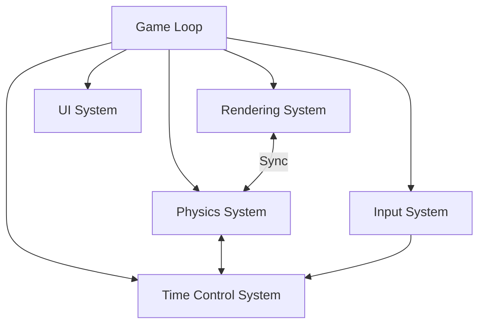

# System Patterns: Bend & Break

## System Architecture
The Bend & Break MVP is built using a modular architecture with several core systems that interact to create the gameplay experience:



## Core Systems

### Game Loop
The central coordinator that runs at 60 FPS and manages the flow of the game:
```javascript
function gameLoop() {
  const delta = clock.getDelta();
  inputSystem.process();
  timeControlSystem.update();
  physicsSystem.step(delta * timeControlSystem.timeScale);
  renderingSystem.update();
  uiSystem.refresh();
  requestAnimationFrame(gameLoop);
}
```

### Rendering System
Handles all visual aspects using Three.js:
- Scene setup with a 5x5 white plane
- Camera positioned at [0, 5, 10] targeting [0, 0, 0]
- Directional lighting
- Rendering of the arm and dummy (single torso block) using BoxGeometry and MeshPhongMaterial
- Visual effects for hits and feedback

### Physics System
Manages physics simulation using Ammo.js:
- Physics world with gravity set to [0, -5, 0] m/s²
- Rigid bodies for the arm segments and dummy (single torso block)
- Hinge constraints for the shoulder and elbow joints
- Collision detection between the arm and dummy
- Force application based on collision velocity

### Input System
Processes user interactions:
- Button-based controls for joint manipulation
- Event handling for button clicks
- Feedback during adjustment phase

### Time Control System
Manages the game's time states:
- Idle: TimeScale = 0 (frozen)
- Adjusting: TimeScale = 0.1 (slow motion during tweaks)
- Resolving: TimeScale = 1 (1s after commit)
- Transitions between states based on user actions

### UI System
Handles the user interface elements:
- Button creation and positioning
- Visual feedback for adjustments and hits
- Win condition display

## Key Technical Decisions

### Time Manipulation
The decision to slow time during adjustments (TimeScale = 0.1) creates a unique gameplay experience where players can carefully plan their moves before committing. This is implemented by controlling the timeScale parameter in the physics simulation.

### Physics-Based Combat
Using physics for combat creates emergent gameplay where small differences in joint angles can lead to significantly different outcomes. This adds depth and replayability to the simple mechanics.

### Button-Based Controls
The MVP uses simple button controls (+10°/-10° for each joint) to ensure accessibility on mobile devices. This approach prioritizes ease of use over the more complex gesture controls planned for the full version.

### Single Arm Focus
Limiting the player's control to a single arm with two segments keeps the MVP scope manageable while still providing enough gameplay depth for the jam submission.

## Data Flow
1. User clicks a button to adjust a joint angle
2. Input system processes the click and updates the joint angle
3. Time control system remains in the adjusting state
4. Physics system applies the new joint angle and advances time slowly (TimeScale = 0.1)
5. Rendering system updates the visual representation
6. User clicks "Commit"
7. Time control system transitions to resolving state
8. Physics system advances time for 1 second
9. Collision detection checks for hits and win condition (dummy torso top y < 0)
10. System returns to idle state